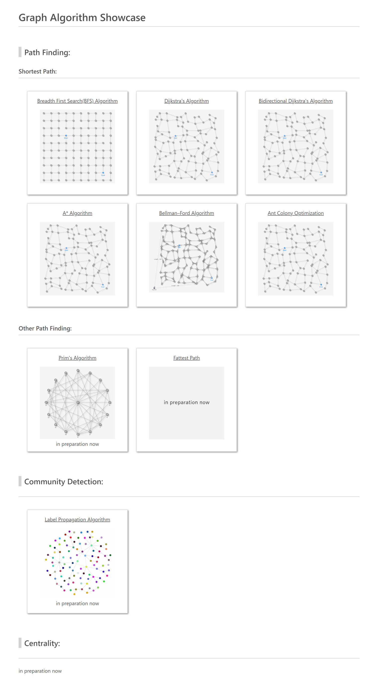

# Graph Algorithm Showcase
This project is a showcase of several graph algorithm demos. The showcase includes Path Finding algorithms, Community Detection algorithms, Centrality algorithms and so on. Algorithms will be added one by one. This application is written by TypeScript (transpiling to JavaScript), so you can easily run this application on your browser even under off-line environment.

#### Demo Site
https://graph-algorithm-showcase.info




## Showcase List

### Path Finding
#### Shortest Path:
- Breadth First Search
- Dijkstra's Algorithm
- Bidirectional Dijkstra's Algorithm
- A* Algorithm
- Bellman–Ford Algorithm
- Ant Colony Optimization

#### Other Path Fiding
- Minimum Spanning Tree: Prim's Algorithm
- Fattest Path

### Community Detection
- Label Propagation

### Centrality
in preparation now

### Other
- Topological Sort


## Tech Stack
- **Language:** TypeScript

- **Usage Library:** Vis.js, Vis-Network.js

- **Build:** Webpack


## Getting Started

### Prerequisites (for just Running Demo)
- only Web Browser ( e.g Chrome, Firefox, Edge )

```
cd graph-algorithm-showcase
start ./public/index.html  # windows
open ./public/index.html  # mac
# otherwise click and open ./public/index.html file by GUI
```
Just only open index.html file, it is runnable under off-line environment.

### Prerequisites (for Building Source)
- Node.js  ( later version 10.x )

#### Setup

``` 
cd graph-algorithm-showcase
npm install
```
After installing command, the necessary libraries are set up. 

( See package.json for more library details. )

#### Build
``` 
cd graph-algorithm-showcase
npx webpack
```
After building, all of bundled files (JavaScript and HTML) are output into /public directory.


## License
This project is licensed under the MIT License.


## References

- Vis-Network [ Network Visualization ]  
https://visjs.org/  
https://visjs.github.io/vis-network/docs/network/  

- Oracle PGX [ Built-In Algorithms ]  
https://docs.oracle.com/cd/E56133_01/latest/reference/analytics/builtins.html  

- Neo4j [ Algorithms ]  
https://neo4j.com/docs/graph-data-science/current/algorithms/  

- Qiita: 2点間-最短経路アルゴリズム Showcase (Japanese Blog)  
https://qiita.com/gamita/items/9e2df8cfa1a7448aca53
