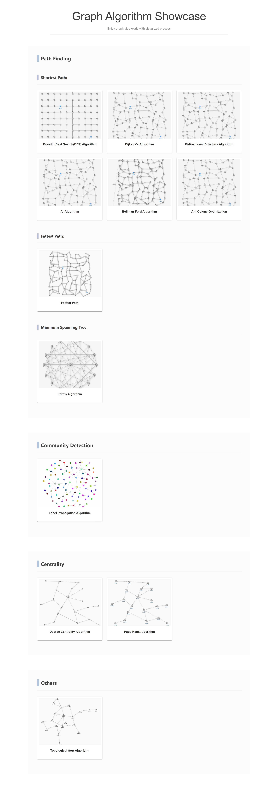

# Graph Algorithm Showcase
This application showcases demos for several graph algorithms you can see and run on your browser. This showcase includes Path Finding algorithms, Community Detection algorithms, Centrality algorithms, and so on. Since this application focuses on visualizing the process of graph algorithms such as animations, you can see how each algorithm works in turn. This application is written by TypeScript, React, and Visjs. For more detail, please see the followings.

#### Demo Site:
https://graph-algorithm-showcase.info




## Showcase List

### Path Finding
#### Shortest Path:
- Breadth First Search
- Dijkstra's Algorithm
- Bidirectional Dijkstra's Algorithm
- A* Algorithm
- Bellman–Ford Algorithm
- Ant Colony Optimization

#### Fattest Path:
- Fattest Path

#### Minimum Spanning Tree:
- Prim's Algorithm

### Community Detection
- Label Propagation

### Centrality
- Degree Centrality
- Page Rank

### Other
- Topological Sort


## Tech Stack
- **Language:** TypeScript

- **Usage Library:** Vis-Network.js, React, MUI


## Build & Deploy

This section mentions how to build and deploy the project; however, if you need not build or deploy on your own, just access the above demo site to check the algorithm's behavior.


### Prerequisites 
- Node.js  ( later version 14.x )
- Web Browser ( e.g. Chrome, Firefox, Edge )

### Setup & Debug

``` 
cd graph-algorithm-showcase    # move to the project root directory.
npm install
npm start
```
After the install and start commands, the necessary libraries will be set up, and then the debug-mode application will be launched. 

(See package.json for more library details.)

### Production Build
``` 
cd graph-algorithm-showcase    # move to the project root directory.
npm run build
```
After the build command, all the bundled files (JavaScript, CSS, and HTML) will be output into the /build directory.

### Deploy on Your Local
``` 
cd graph-algorithm-showcase    # move to the project root directory.
npm install -g serve    # If you've already installed "serve", then skip.
serve -s build
```
After the serve command, as the access URL will be displayed, you can access the showcase pages of the built module.


## License
This project is licensed under the MIT License.


## References

- Vis-Network [ Network Visualization ]  
https://visjs.org/  
https://visjs.github.io/vis-network/docs/network/  

- Oracle PGX [ Built-In Algorithms ]  
https://docs.oracle.com/cd/E56133_01/latest/reference/analytics/builtins.html  

- Neo4j [ Algorithms ]  
https://neo4j.com/docs/graph-data-science/current/algorithms/  

- Qiita: 2点間-最短経路アルゴリズム Showcase (Japanese Blog)  
https://qiita.com/gamita/items/9e2df8cfa1a7448aca53
